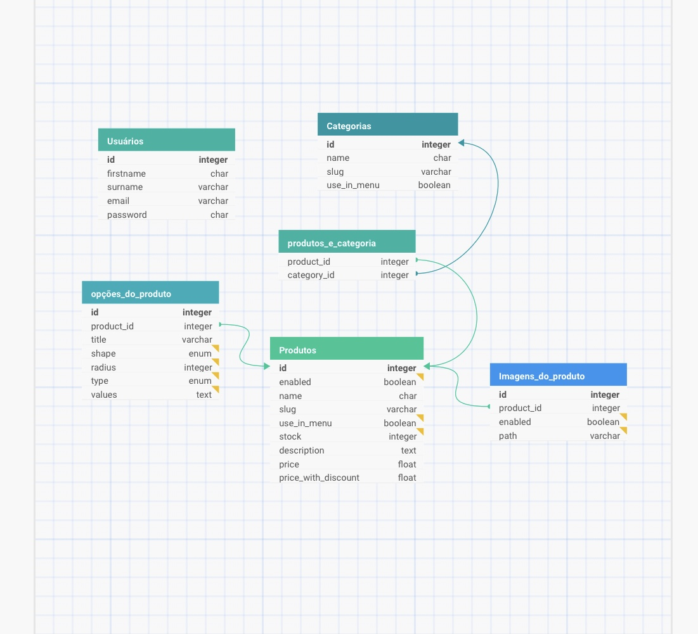

# E-commerce Backend API

Backend de uma aplicação e-commerce desenvolvida como projeto do curso Geração Tech. A API fornece endpoints para gerenciamento de usuários, categorias e produtos, com autenticação JWT.

## Tecnologias Utilizadas

- **Node.js** - Ambiente de execução JavaScript
- **Express.js** - Framework web para criação de APIs
- **MySQL** - Banco de dados relacional
- **Sequelize** - ORM para MySQL
- **JWT** - Autenticação e autorização
- **bcrypt** - Criptografia de senhas
- **Jest** - Framework de testes
- **Dotenv** - Gerenciamento de variáveis de ambiente
- **Nodemon** - Ferramenta de desenvolvimento

## Estrutura do Projeto

```
project-root/
├── src/
│   ├── config/      # Configurações do projeto
│   ├── controllers/ # Controladores da aplicação
│   ├── middleware/  # Middlewares customizados
│   ├── models/      # Modelos do Sequelize
│   ├── routes/      # Rotas da API
│   ├── services/    # Camada de serviços
│   ├── app.js       # Configuração do Express
│   └── server.js    # Entrada da aplicação
├── tests/           # Testes automatizados
├── .env            # Variáveis de ambiente
├── .gitignore
└── package.json
```

## Modelagem do Banco de Dados



A imagem acima representa o Diagrama de Entidade-Relacionamento (DER) do projeto, ilustrando as tabelas e seus relacionamentos:

- **Users**: Armazena informações dos usuários
- **Categories**: Gerencia as categorias dos produtos
- **Products**: Contém os dados dos produtos
- **Product_Images**: Armazena as imagens dos produtos
- **Product_Options**: Mantém as opções/variações dos produtos
- **Product_Categories**: Tabela pivot para relacionamento many-to-many entre produtos e categorias

## Instalação

1. Clone o repositório
```bash
git clone https://github.com/Elias-David/projeto-backend.git
```
2. Instale as dependências:
```bash
npm install
```
3. Configure as variáveis de ambiente no arquivo `.env`:
```env
DB_HOST=localhost
DB_USER=seu_usuario
DB_PASS=sua_senha
DB_NAME=nome_do_banco
DB_PORT=3306
APP_KEY_TOKEN=sua_chave_secreta
```


## Scripts Disponíveis
- `npm start`: Inicia a aplicação em produção
- `npm run dev`: Inicia a aplicação em desenvolvimento com Nodemon
- `npm test`: Executa os testes unitários
- `npm run test:coverage`: Executa os testes e gera relatório de cobertura

## API Endpoints

### Usuários

- `GET /v1/user/:id` - Retorna dados de um usuário
- `POST /v1/user` - Cria novo usuário
- `PUT /v1/user/:id` - Atualiza dados do usuário
- `DELETE /v1/user/:id` - Remove usuário
- `POST /v1/user/token` - Gera token JWT

### Categorias

- `GET /v1/category/search` - Lista categorias com filtros
- `GET /v1/category/:id` - Retorna dados de uma categoria
- `POST /v1/category` - Cria nova categoria
- `PUT /v1/category/:id` - Atualiza categoria
- `DELETE /v1/category/:id` - Remove categoria

### Produtos

- `GET /v1/product/search` - Lista produtos com filtros
- `GET /v1/product/:id` - Retorna dados de um produto
- `POST /v1/product` - Cria novo produto
- `PUT /v1/product/:id` - Atualiza produto
- `DELETE /v1/product/:id` - Remove produto

## Autenticação

A API utiliza autenticação JWT. Para rotas protegidas, inclua o token no header:
```
Authorization: Bearer <seu_token>
```

## Documentação Detalhada da API

A documentação completa da API, incluindo:
- Descrição detalhada de todos os endpoints
- Exemplos de requisição e resposta
- Parâmetros aceitos
- Códigos de status HTTP
- Formatos de payload

Está disponível no arquivo [API.md](API.md).

## Testando a API com Insomnia

Para facilitar os testes dos endpoints, disponibilizamos uma collection do Insomnia na raiz do projeto.

### Como usar:
1. Faça download do [Insomnia](https://insomnia.rest/download)
2. No Insomnia, clique em `Create` e depois em `Import from File`
3. Selecione o arquivo `insomnia_backend_project.json` da raiz do projeto
4. A collection será importada com todos os endpoints organizados nas pastas:
   - Auth: Autenticação e geração de token
   - Users: Gerenciamento de usuários
   - Categories: Gerenciamento de categorias
   - Products: Gerenciamento de produtos

Os endpoints já estão configurados com:
- URLs corretas
- Headers necessários
- Exemplos de payload
- Variáveis de ambiente para o token JWT

## Referências

- [ORIENTAÇÕES PROJETO BACK-END](https://github.com/digitalcollegebr/projeto-backend)
- [DOCUMENTAÇÃO EXTRA - NOTION](https://dust-starburst-c57.notion.site/Desenvolvimento-Back-End-JavaScript-5038d9fff41d45688f698f7d88a5a19e)

## Autores

- [Elias David](https://github.com/Elias-David)
- [Ruth Siqueira](https://github.com/Ruth-sc)